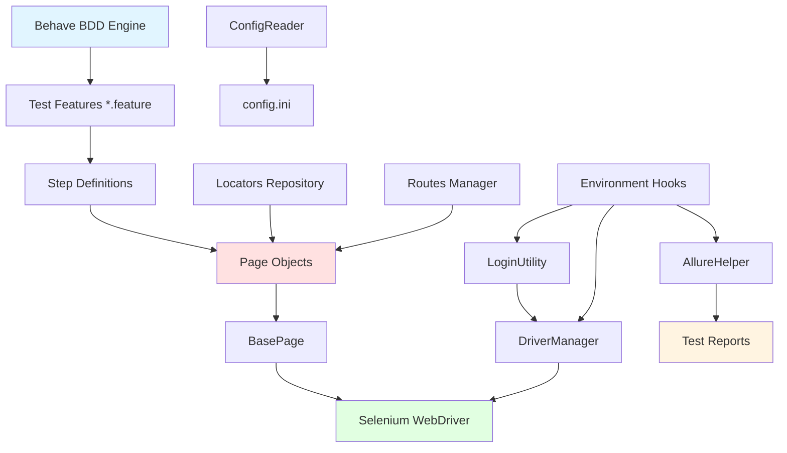

# 🤖 HBOX AI NG PEP v2 - UI Test Automation Framework

A comprehensive Behavior-Driven Development (BDD) automation framework for HBOX AI's Next-Generation Patient Engagement Platform v2. Built with Python, Selenium, and Behave, featuring advanced reporting, parallel execution, and intelligent driver management.

## 📋 Table of Contents

- [🚀 Quick Start](#-quick-start)
- [🏗️ Project Architecture](#️-project-architecture)
- [📁 Project Structure](#-project-structure)
- [🛠️ Core Components](#️-core-components)
- [📄 Page Objects](#-page-objects)
- [🔧 Utilities & Helpers](#-utilities--helpers)
- [🏥 Application Under Test](#-application-under-test)
- [🔐 User Roles & Authentication](#-user-roles--authentication)
- [📊 Reporting System](#-reporting-system)
- [🧪 Test Execution](#-test-execution)
- [⚙️ Configuration Management](#️-configuration-management)
- [✅ Best Practices](#-best-practices)
- [🔍 Troubleshooting](#-troubleshooting)

---

## 🚀 Quick Start

### Prerequisites
- **Python 3.11+**
- **Node.js** (for Allure CLI)
- **Chrome/Chromium** browser (115+ recommended)
- **Git** for version control

### Installation & Setup

```bash
# Clone the repository
git clone <repository-url>
cd automation-hbox-ng-pepv2

# Create and activate virtual environment
python -m venv .venv
source .venv/bin/activate  # On Windows: .venv\Scripts\activate

# Install Python dependencies
pip install -r requirements.txt

# Install Allure CLI globally
npm install -g allure-commandline

# Configure test credentials (IMPORTANT: Never commit this file!)
cp configuration/config.ini.template configuration/config.ini
# Edit configuration/config.ini with your actual test credentials
```

### Run Your First Test

```bash
# Run login test suite
behave features/all_features/00_Login/

# Run specific feature
behave features/all_features/01_Dashboard/tc01-main_dashboard.feature

# Run tests with specific tags
behave --tags=@smoke

# Generate and view Allure report
allure serve Reports/features
```

---

## 🏗️ Project Architecture



### Architecture Principles

1. **Behavior-Driven Development (BDD)**: Test scenarios written in Gherkin language
2. **Page Object Model (POM)**: UI elements and actions encapsulated in page classes
3. **XPath-Only Locators**: Consistent locator strategy across all pages
4. **Separation of Concerns**: Clear boundaries between test logic, page interactions, and utilities
5. **Data-Driven Testing**: Configurable test data and environment settings
6. **Parallel Execution**: Support for concurrent test runs via BehaveX

---

## 📁 Project Structure

```
automation-hbox-ng-pepv2/
├── .github/                           # GitHub configurations
│   ├── copilot-instructions.md       # AI assistant instructions
│   └── instructions/                  # Additional instruction files
├── configuration/                     # Environment configurations
│   ├── config.ini                    # Test credentials (gitignored)
│   ├── config.ini.template           # Template for credentials
│   └── jenkins-config.ini            # CI/CD configuration
├── docs/                             # Documentation
├── drivers/                          # ChromeDriver binaries
├── features/                         # BDD test features
│   ├── all_features/                # All test feature files
│   │   ├── 00_Login/                # Login test scenarios
│   │   ├── 01_Dashboard/            # Dashboard tests
│   │   ├── 02_Users/                # User management tests
│   │   ├── 03_Program_Type/         # Program type tests
│   │   ├── 04_Patient_Groups/       # Patient group tests
│   │   ├── 05_Activities/           # Activities tests
│   │   ├── 06_Workflow_and_Tasks/   # Workflow tests
│   │   ├── 07_Facility_Availability/ # Facility tests
│   │   ├── 09_Scheduled_Appointments/ # Appointment tests
│   │   ├── 10_Search_Patients/      # Patient search tests
│   │   ├── 12_Add_Patient/          # Patient addition tests
│   │   └── 13_User_Dashboard/       # User dashboard tests
│   ├── commons/                      # Shared resources
│   │   ├── locators.py              # Centralized locator repository
│   │   └── routes.py                # URL route definitions
│   ├── pages/                        # Page Object classes
│   │   ├── base_page.py             # Base page with common methods
│   │   ├── login_page/              # Login page objects
│   │   ├── dashboard_page/          # Dashboard page objects
│   │   ├── users_page/              # User management page objects
│   │   ├── program_type_page/       # Program type page objects
│   │   ├── patient_groups_page/     # Patient groups page objects
│   │   ├── activities_page/         # Activities page objects
│   │   ├── workflow_tasks_page/     # Workflow/tasks page objects
│   │   ├── facility_availability_page/ # Facility page objects
│   │   ├── scheduled_appointments_page/ # Appointments page objects
│   │   ├── search_patients_page/    # Patient search page objects
│   │   ├── add_patient_page/        # Add patient page objects
│   │   ├── user_dashboard_page/     # User dashboard page objects
│   │   └── patient_details_page/    # Patient details page objects
│   ├── steps/                        # Step definition implementations
│   │   ├── tc00-login_steps.py through tc30-user_dashboard_steps.py
│   │   └── (30+ step definition files)
│   └── environment.py                # Behave hooks (before/after)
├── utils/                            # Utility modules
│   ├── ui/                          # UI automation utilities
│   │   ├── allure_helper.py        # Allure reporting helper
│   │   ├── chromedriver_setup.py   # ChromeDriver downloader
│   │   ├── config_reader.py        # Configuration reader
│   │   ├── cumulative_report_utils.py # Report management
│   │   ├── driver_manger.py        # WebDriver manager
│   │   ├── login_utility.py        # Login automation
│   │   ├── popup_handler.py        # Popup auto-closer
│   │   ├── watch_allure.py         # Live report watcher
│   │   └── webdriver_helper.py     # WebDriver creation
│   ├── logger.py                    # Logging utility
│   └── utils.py                     # General utilities
├── Reports/                          # Test reports (gitignored)
│   ├── features/                    # Allure results
│   └── cumulative-results/          # Cumulative history
├── behave.ini                        # Behave configuration
├── conf_behavex.cfg                  # BehaveX parallel config
├── pytest.ini                        # Pytest configuration
├── requirements.txt                  # Python dependencies
├── Jenkinsfile                       # Jenkins pipeline
└── README.md                         # This file
```

---

## 🛠️ Core Components

### 1. BasePage (`features/pages/base_page.py`)

The foundation of all page objects, providing reusable methods for web interactions.

**Key Capabilities:**
- **Element Interactions**: Click, type, select, drag-drop with retry logic
- **Wait Strategies**: Explicit waits for visibility, clickability, invisibility
- **Alert Handling**: Accept, dismiss, and read alert messages
- **Frame Management**: Switch between frames and default content
- **Table Operations**: Read table data, handle pagination
- **Scroll Actions**: Scroll to elements, scroll by pixels
- **JavaScript Execution**: Execute custom JS when needed
- **Screenshot Capture**: Take screenshots for debugging
- **Error Recovery**: Automatic retry for stale elements

**Core Methods:**
```python
find_element(locator)           # Find single element
find_elements(locator)          # Find multiple elements
click(locator)                  # Click with retry logic
type(locator, text)             # Clear and type text
wait_for_element(locator)       # Wait for element visibility
select_dropdown(locator, text)  # Select dropdown option
get_text(locator)               # Get element text
is_element_visible(locator)     # Check visibility
scroll_to_element(locator)      # Scroll element into view
take_screenshot(filename)       # Capture screenshot
```

### 2. Locators Repository (`features/commons/locators.py`)

Centralized storage for all XPath locators, organized by page sections.

**Structure:**
**Structure:**
```python
class LoginPageLocators:
    EMAIL_INPUT = (By.XPATH, "//input[@id='email']")
    PASSWORD_INPUT = (By.XPATH, "//input[@id='password']")
    SUBMIT_BUTTON = (By.XPATH, "//button[normalize-space()='Submit']")
    
class DashboardPageLocators:
    HAMBURGER_MENU = (By.XPATH, "//button[@id='admin_header_toggle_sidebar_btn']")
    # ... more locators
```

**Available Locator Classes:**
- `LoginPageLocators`
- `DashboardPageLocators`
- `UsersPageLocators`
- `ProgramTypePageLocators`
- `PatientGroupsPageLocators`
- `ActivitiesPageLocators`
- `WorkflowPageLocators`
- `TasksPageLocators`
- `FacilityAvailabilityPageLocators`
- `ScheduledAppointmentsPageLocators`
- `SearchPatientsPageLocators`
- `AddPatientPageLocators`
- `UserDashboardPageLocators`

### 3. Routes Manager (`features/commons/routes.py`)

Centralized route definitions for consistent navigation across all page objects.

**Key Routes:**
```python
class Routes:
    LOGIN = "/"
    DASHBOARD = "/admin/dashboard"
    USERS_PAGE = "/admin/users"
    PROGRAM_TYPE = "/admin/program-type"
    PATIENT_GROUPS = "/admin/patient-groups"
    ACTIVITIES = "/admin/activities"
    WORKFLOW = "/admin/workflow"
    FACILITY_AVAILABILITY = "/admin/facility-availability"
    SCHEDULED_APPOINTMENTS = "/admin/scheduled-appointments"
    SEARCH_PATIENTS = "/admin/search-patients"
    ADD_PATIENT = "/admin/add-patient"
    
    @staticmethod
    def set_base_url(base_url, environment):
        # Dynamically set base URL for different environments
```

### 4. Environment Hooks (`features/environment.py`)

Manages test lifecycle with Behave hooks for setup and teardown.

**Hooks Implemented:**
```python
def before_all(context):
    # Initialize DriverManager
    # Setup Allure folders
    # Configure base URL and environment
    
def before_feature(context, feature):
    # Handle automatic login based on tags
    # Enable popup handlers
    # Assign Allure suite labels
    
def after_scenario(context, scenario):
    # Accumulate Allure results
    # Take screenshot on failure
    
def after_feature(context, feature):
    # Quit all drivers for the feature
    
def after_all(context):
    # Final cleanup and report generation
```

---

## 📄 Page Objects

All page objects inherit from `BasePage` and implement the Page Object Model pattern.

### Example: Users Page (`features/pages/users_page/`)

```python
class UsersPage(BasePage):
    def __init__(self, driver):
        super().__init__(driver)
        
    def navigate_to_users_page(self):
        self.navigate_to_route(Routes.USERS_PAGE)
        
    def search_user_by_name(self, name):
        self.select_dropdown(UsersPageLocators.SEARCH_TYPE_DROPDOWN, "Name")
        self.type(UsersPageLocators.SEARCH_INPUT, name)
        self.click(UsersPageLocators.SEARCH_BUTTON)
        
    def click_add_user_button(self):
        self.click(UsersPageLocators.ADD_USER_BUTTON)
```

### Available Page Objects

| Module | Purpose | Key Features |
|--------|---------|--------------|
| `login_page` | User authentication | Login, logout, error handling |
| `dashboard_page` | Main dashboard | Navigation, hamburger menu, user profile |
| `users_page` | User & group management | CRUD operations, search, filtering |
| `program_type_page` | Program type management | Create, edit, delete programs |
| `patient_groups_page` | Patient group operations | EMR, filter, Excel-based groups |
| `activities_page` | Activity management | Activity CRUD, E2E workflows |
| `workflow_tasks_page` | Workflow & task management | Workflow status, task operations |
| `facility_availability_page` | Resource scheduling | Facility CRUD, availability |
| `scheduled_appointments_page` | Appointment handling | View, schedule, manage appointments |
| `search_patients_page` | Patient lookup | Multi-criteria search |
| `add_patient_page` | Patient enrollment | Add new patients |
| `user_dashboard_page` | User-specific dashboard | VPE internal user operations |

---

## 🔧 Utilities & Helpers

### Driver Manager (`utils/ui/driver_manger.py`)

Manages multiple WebDriver instances for different user roles and parallel execution.

**Features:**
- **Role-Based Drivers**: Support for multiple user roles simultaneously
- **Smart Mode Detection**: Automatically detects local vs remote execution
- **Selenoid Support**: Can use Selenoid for remote browser execution
- **Driver Lifecycle**: Proper creation, retrieval, and cleanup

**User Roles:**
```python
class DriverRole(Enum):
    DEFAULT = "default"
    ENROLLER_ADMIN = "enroller_admin"      # enroller.admin@hbox.ai
    VPE_ADMIN = "vpe_admin"                # VPE admin role
    VPE_USER = "vpe_user"                  # john.p@hbox.ai
    CS_ADMIN = "cs_admin"                  # CS admin role
    CS_USER = "cs_user"                    # linda.e@hbox.ai
    PES_ADMIN = "pes_admin"                # PES admin role
    PES_USER = "pes_user"                  # akila.d@hbox.ai
```

**Usage:**
```python
driver_manager = DriverManager()
driver = driver_manager.create_driver("chrome", "test_session", context, DriverRole.ENROLLER_ADMIN)
driver = driver_manager.get_driver(DriverRole.ENROLLER_ADMIN)
driver_manager.quit_driver(DriverRole.ENROLLER_ADMIN)
```

### Login Utility (`utils/ui/login_utility.py`)

Automates user authentication with role-based credential management.

**Key Features:**
- **Tag-Based Auto-Login**: Automatically logs in based on `@login_<role>` tags in feature files
- **Smart Driver Management**: Creates and manages drivers per role
- **Retry Logic**: Handles transient login failures
- **Session Isolation**: Maintains separate sessions for different roles

**Supported Login Tags:**
- `@login_enroller_admin` - Enroller admin access (enroller.admin@hbox.ai)
- `@login_vpe_internal` - VPE internal user (vpe.auto01@hbox.ai)
- `@login_vpe_user` - VPE standard user (john.p@hbox.ai)
- `@login_cs_internal` - CS internal user (cs.auto01@hbox.ai)
- `@login_cs_user` - CS standard user (linda.e@hbox.ai)
- `@login_pes_internal` - PES internal user (pes.auto01@hbox.ai)
- `@login_pes_user` - PES standard user (akila.d@hbox.ai)
- `@login_parallel` - For parallel execution tests

**Usage:**
```python
# Automatically called in environment.py
LoginHelper.handle_automatic_login(context, feature)

# Manual login
LoginHelper.perform_role_based_login(context, DriverRole.ENROLLER_ADMIN)
```

### Allure Helper (`utils/ui/allure_helper.py`)

Comprehensive Allure reporting management with advanced features.

**Capabilities:**
- **Suite Organization**: Auto-assigns parent suite from folder structure
- **Failure Attachments**: Automatic screenshot and URL capture on failures
- **Cumulative Reporting**: Maintains test history across multiple runs
- **Tag Management**: Handles Allure labels and tags
- **Report Generation**: Commands for local and CI report generation

**Key Methods:**
```python
AllureHelper.setup_allure_folders()                    # Initialize directories
AllureHelper.assign_feature_suite(context, feature)    # Set suite hierarchy
AllureHelper.attach_failure(driver, step_name)         # Capture failure evidence
AllureHelper.accumulate_results()                      # Add to cumulative results
AllureHelper.generate_cumulative_report()              # Generate full report
```

### Config Reader (`utils/ui/config_reader.py`)

Centralized configuration management for environment-specific settings.

**Functions:**
```python
read_configuration(section, key)     # Read config value
is_allure_enabled()                  # Check if Allure is enabled
is_headless_mode()                   # Check headless browser mode
get_driver_mode()                    # Get driver mode (local/remote)
get_execution_mode()                 # Get execution mode (local/ci)
```

### Popup Handler (`utils/ui/popup_handler.py`)

Automatically closes appointment reminder popups using JavaScript mutation observers.

**Features:**
- **Non-Intrusive**: Uses JavaScript observers to detect and close popups
- **Multi-Driver Support**: Works across multiple browser sessions
- **Automatic**: Installs once and handles all future popups

**Usage:**
```python
PopupHandler.enable_appointment_reminder_handler(context)
```

### WebDriver Helper (`utils/ui/webdriver_helper.py`)

WebDriver creation and configuration utilities.

**Capabilities:**
- **Cross-Platform**: Works on Windows, macOS, Linux
- **ChromeDriver Setup**: Automatic driver download and setup
- **Browser Options**: Configures Chrome with optimal flags
- **Remote Support**: Can create remote WebDriver for Selenoid

### Watch Allure (`utils/ui/watch_allure.py`)

Live reload server for continuous report viewing during development.

**Usage:**
```bash
python utils/ui/watch_allure.py
# Opens browser at http://localhost:8084
# Auto-regenerates report when test results change
```

### Cumulative Report Utils (`utils/ui/cumulative_report_utils.py`)

Command-line tool for managing cumulative Allure reports.

**Commands:**
```bash
python utils/ui/cumulative_report_utils.py status    # Check cumulative results
python utils/ui/cumulative_report_utils.py clear     # Clear cumulative data
python utils/ui/cumulative_report_utils.py generate  # Generate report
```

---

## 🏥 Application Under Test

### HBOX AI Next-Generation Patient Engagement Platform v2

A comprehensive healthcare management platform with role-based access control.

### Functional Areas

#### 1. **Dashboard Management**
- Main dashboard overview
- Navigation menu
- User profile management

#### 2. **User Management**
- User CRUD operations
- User group management
- Role and permission assignment
- User search and filtering

#### 3. **Program Type Management**
- Program type configuration
- Patient program status management
- CRUD operations for programs

#### 4. **Patient Groups**
- EMR-based group creation
- Filter-based group management
- Excel import for bulk groups
- Group CRUD operations

#### 5. **Activities Management**
- Activity creation and configuration
- Activity CRUD operations
- End-to-end activity workflows

#### 6. **Workflow & Tasks**
- Workflow configuration
- Workflow status management
- Task creation and assignment
- CRUD operations for workflows and tasks

#### 7. **Facility Availability**
- Facility scheduling
- Availability management
- Resource allocation

#### 8. **Scheduled Appointments**
- Appointment viewing
- Appointment scheduling
- Calendar integration

#### 9. **Patient Operations**
- Patient search (multi-criteria)
- Patient enrollment
- Patient details management

#### 10. **User Dashboard**
- VPE internal user operations
- Personalized dashboards
- Quick access features

---

## 🔐 User Roles & Authentication

### Available Roles

| Role | Username Key | Description | Access Level |
|------|--------------|-------------|--------------|
| Enroller Admin | `enroller_admin_user_name` | Full administrative access | High |
| VPE Internal User | `vpe_internal_user_name` | VPE internal operations | Medium |
| VPE User | `vpe_user_user_name` | VPE standard user | Medium |
| CS Internal User | `cs_internal_user_name` | CS internal operations | Medium |
| CS User | `cs_user_user_name` | CS standard user | Medium |
| PES Internal User | `pes_internal_user_name` | PES internal operations | Medium |
| PES User | `pes_user_user_name` | PES standard user | Medium |

### Credential Management

Credentials are stored in `configuration/config.ini` (gitignored):

```ini
[basic info]
browser=chrome

[local_env]
url=http://ng-pep-frontend

[stg_env]
url=https://ngpepv2-sandbox.hbox.ai

[prod_env]
url=https://ngpep.hbox.ai

[Credentials]
twilio_number=7206398544
enroller_admin_user_name=enroller.admin@hbox.ai
vpe_user_user_name=john.p@hbox.ai
vpe_internal_user_name=vpe.auto01@hbox.ai
cs_internal_user_name=cs.auto01@hbox.ai
pes_internal_user_name=pes.auto01@hbox.ai
cs_user_user_name=linda.e@hbox.ai
pes_user_user_name=akila.d@hbox.ai

common_stg_password=your_password_here
common_local_password=your_password_here

[Execution Environment]
execution_mode = local  # local or ci_cd
driver_mode = local     # local or remote

[Selenoid]
selenoid_url = http://localhost:4444/wd/hub
enable_vnc = true
enable_video = false
enable_log = true
session_timeout = 300s
chrome_version = latest
```

### Auto-Login Feature

Tests automatically log in based on feature tags:

```gherkin
@login_enroller_admin
Feature: User Management
  Scenario: Create new user
    # Automatically logged in as enroller_admin before this scenario
```

---

## 📊 Reporting System

### Allure Reports

Beautiful, interactive HTML reports with comprehensive test details.

**Report Features:**
- **Test Results Dashboard**: Pass/fail statistics, trends
- **Test Suites**: Organized by feature folders
- **Timeline**: Execution timeline visualization
- **Categories**: Custom failure categorization
- **Screenshots**: Automatic screenshot on failure
- **History**: Historical test execution data
- **Behaviors**: BDD-style test organization

**Generate and View Reports:**
```bash
# Generate report from latest results
allure generate Reports/features --clean -o Reports/allure-report

# Serve report (auto-opens browser)
allure serve Reports/features

# Open static report
allure open Reports/allure-report
```

### Cumulative Reporting

Maintains complete test history across multiple test runs.

**How It Works:**
1. Each test run generates results in `Reports/features/`
2. Results are copied to `Reports/cumulative-results/`
3. Report generation includes historical data
4. Test trends and history preserved across runs

**Benefits:**
- Track test stability over time
- Identify flaky tests
- View historical pass/fail trends
- Complete audit trail

**Report Modes:**
- **Cumulative** (Default): Loads previous + adds current + saves
- **Fresh**: Clean run, ignores history
- **Incremental**: Loads previous + adds current, no save

---

## 🧪 Test Execution

### Basic Execution

```bash
# Run all tests
behave

# Run specific feature file
behave features/all_features/01_Dashboard/tc01-main_dashboard.feature

# Run specific folder
behave features/all_features/02_Users/

# Run with tags
behave --tags=@smoke
behave --tags=@regression
behave --tags=@login_enroller_admin

# Exclude tags
behave --tags=~@skip
behave --tags=~@wip

# Combined tags
behave --tags=@smoke --tags=~@skip
```

### Parallel Execution with BehaveX

Run tests in parallel for faster execution.

```bash
# Run with 5 parallel processes (feature-level)
behavex --parallel-processes=5 --parallel-scheme=feature

# Run with 4 parallel processes (scenario-level)
behavex --parallel-processes=4 --parallel-scheme=scenario

# Run specific tags in parallel
behavex --tags=@regression --parallel-processes=5 --parallel-scheme=feature

# Exclude tags and run in parallel
behavex -t=~@wip -t=~@skip --parallel-processes=5 --parallel-scheme=feature

# With configuration file
behavex --config conf_behavex.cfg

# Most used command (from conf_behavex.cfg)
behavex --config conf_behavex.cfg -t=~@wip ~@skip --parallel-processes=5 --parallel-scheme=feature --show-progress-bar
```

### Environment Selection

```bash
# Run against local environment
behave -D env=local
# Uses: http://ng-pep-frontend

# Run against staging (default)
behave -D env=stg
# Uses: https://ngpepv2-sandbox.hbox.ai

# Run against production
behave -D env=prod
# Uses: https://ngpep.hbox.ai
```

### Headless Mode

```bash
# Set in config.ini or environment variable
export HEADLESS=true
behave

# Or in config.ini
[browser_options]
headless = true
```

### Advanced Options

```bash
# Verbose output
behave --verbose --no-capture

# Dry run (list scenarios without running)
behave --dry-run

# Stop on first failure
behave --stop

# Format output
behave --format pretty

# Multiple formatters
behave --format allure_behave.formatter:AllureFormatter --format pretty
```

---

## ⚙️ Configuration Management

### Configuration Files

#### `behave.ini`
Primary configuration for Behave test runner.

```ini
[behave]
default_tags = not (@xfail or @not_implemented or @wip or @skip or @manual)
show_skipped = false
paths = features/all_features
format = allure_behave.formatter:AllureFormatter
outfiles = Reports/features
capture = false

[behave.userdata]
env = local
```

#### `conf_behavex.cfg`
Configuration for parallel execution with BehaveX.

```properties
[output]
path = Reports/features

[params]
tags = ''
define = env=stg
parallel_processes = 5
parallel_scheme = scenario
formatter = allure_behave.formatter:AllureFormatter

[test_run]
tags_to_skip = skip, not_implemented, xfail
```

#### `configuration/config.ini`
Environment and credential configuration (gitignored).

```ini
[basic info]
browser=chrome

[local_env]
url=http://ng-pep-frontend

[stg_env]
url=https://ngpepv2-sandbox.hbox.ai

[prod_env]
url=https://ngpep.hbox.ai

[Credentials]
enroller_admin_user_name=enroller.admin@hbox.ai
vpe_internal_user_name=vpe.auto01@hbox.ai
cs_internal_user_name=cs.auto01@hbox.ai
pes_internal_user_name=pes.auto01@hbox.ai

common_stg_password=your_password_here
common_local_password=your_password_here

[Execution Environment]
execution_mode = local  # local or ci_cd
driver_mode = local     # local or remote

[Selenoid]
selenoid_url = http://localhost:4444/wd/hub
enable_vnc = true
enable_video = false
```

### Environment Variables

Override configuration via environment variables:

```bash
# Browser options
export HEADLESS=true

# Allure reporting
export DISABLE_ALLURE_REPORTS=false

# Driver configuration
export DRIVER_MODE=remote           # local or remote
export EXECUTION_MODE=ci_cd         # local or ci_cd

# Selenoid configuration
export SELENOID_URL=http://localhost:4444/wd/hub
```

---

## ✅ Best Practices

### Writing Test Scripts

#### ✅ DO:
- **Use XPath-only locators** - Project requirement, consistent strategy
- **Follow Page Object Model** - Keep UI interactions in page classes
- **Write atomic steps** - Each step performs one clear action
- **Add meaningful assertions** - Verify expected outcomes
- **Use explicit waits** - Never use `time.sleep()`, use WebDriverWait
- **Handle errors gracefully** - Try-catch with proper logging
- **Add descriptive scenario names** - Clear, business-readable names
- **Tag scenarios appropriately** - Use `@smoke`, `@regression`, etc.
- **Reuse page objects** - Don't duplicate code
- **Log important actions** - Use `printf()` for debugging
- **Take screenshots on failure** - Automatic via BasePage
- **Use data-driven approaches** - Scenario outlines for similar tests

#### ❌ DON'T:
- **Don't use CSS selectors** - XPath only (project requirement)
- **Don't hardcode credentials** - Use `config.ini`
- **Don't commit config.ini** - Always gitignored
- **Don't use `time.sleep()`** - Use explicit waits
- **Don't mix test logic in page objects** - Separation of concerns
- **Don't skip error handling** - Always catch and log exceptions
- **Don't use absolute XPaths** - Prefer relative, robust XPaths
- **Don't duplicate locators** - Centralize in `locators.py`
- **Don't leave debug code** - Clean up print statements
- **Don't ignore failures** - Investigate and fix flaky tests

### Writing XPath Locators

#### Best Practices:
```python
# ✅ GOOD: Relative, robust locators
EMAIL_INPUT = (By.XPATH, "//input[@id='email']")
SUBMIT_BUTTON = (By.XPATH, "//button[normalize-space()='Submit']")
USERS_TABLE_ROWS = (By.XPATH, "//table[@id='table-admin-users']/tbody/tr")

# ✅ GOOD: Text-based with normalize-space()
ERROR_MESSAGE = (By.XPATH, "//div[normalize-space(text())='Email or password is incorrect']")
MENU_OPTION = (By.XPATH, "//a/span[normalize-space(text())='Users']")

# ✅ GOOD: Dynamic locators with lambda
SEARCH_TYPE_OPTION = lambda option_text: (By.XPATH, f"//div[@role='option']//span[normalize-space(text())='{option_text}']")
VALIDATION_ERROR = lambda error: (By.XPATH, f"//p[normalize-space(text())='{error}']")

# ❌ BAD: Absolute path (brittle)
BAD_BUTTON = (By.XPATH, "/html/body/div[1]/div[2]/div[3]/button")

# ❌ BAD: Using class names (unstable)
BAD_ERROR = (By.XPATH, "//div[@class='error-message-container']")

# ❌ BAD: Using CSS selector (not allowed)
BAD_CSS = (By.CSS_SELECTOR, "#email")  # XPath only!
```

### Page Object Structure

#### Pattern:
```python
from features.commons.locators import UsersPageLocators
from features.pages.base_page import BasePage

class UsersPage(BasePage):
    """Page object for Users management functionality."""
    
    def __init__(self, driver):
        super().__init__(driver)
        self.locators = UsersPageLocators
    
    def click_add_user_button(self):
        """Click the Add New User button."""
        self.click_element(self.locators.ADD_NEW_USER_BUTTON)
    
    def enter_user_details(self, first_name, last_name, email):
        """Enter user information in the form."""
        self.send_keys_to_element(self.locators.FIRST_NAME_INPUT, first_name)
        self.send_keys_to_element(self.locators.LAST_NAME_INPUT, last_name)
        self.send_keys_to_element(self.locators.EMAIL_INPUT, email)
    
    def get_user_count(self):
        """Return the number of users in the table."""
        return len(self.find_elements(self.locators.USERS_TABLE_ROWS))
```

### Step Definition Structure

#### Pattern:
```python
from behave import given, when, then
from features.pages.users_page.users_page import UsersPage

@when('I click the add user button')
def step_click_add_user(context):
    """Step to click add user button."""
    users_page = UsersPage(context.driver)
    users_page.click_add_user_button()

@when('I enter user details with first name "{first_name}", last name "{last_name}", and email "{email}"')
def step_enter_user_details(context, first_name, last_name, email):
    """Step to enter user details."""
    users_page = UsersPage(context.driver)
    users_page.enter_user_details(first_name, last_name, email)

@then('I should see {count:d} users in the table')
def step_verify_user_count(context, count):
    """Step to verify user count."""
    users_page = UsersPage(context.driver)
    actual_count = users_page.get_user_count()
    assert actual_count == count, f"Expected {count} users, found {actual_count}"
```

### Feature File Structure

#### Pattern:
```gherkin
@users @smoke
Feature: User Management
  As an admin user
  I want to manage user accounts
  So that I can control system access

  Background:
    Given I am logged in as "enroller_admin_user@test.com"
    And I am on the users page

  @create_user
  Scenario: Successfully create a new user
    When I click the add user button
    And I enter user details with first name "John", last name "Doe", and email "john.doe@test.com"
    And I select user type "VPE Internal"
    And I click the save button
    Then I should see a success notification "User Created"
    And the new user should appear in the users table

  @search_user
  Scenario Outline: Search users by different criteria
    When I select search type "<search_type>"
    And I enter search value "<search_value>"
    And I click the search button
    Then I should see search results for "<search_value>"

    Examples:
      | search_type | search_value       |
      | Name        | John Doe           |
      | Email       | john.doe@test.com  |
```

---

## 🏥 Product Overview

### Role-Based Access Structure

The platform has **two major user roles**:

#### 1. **Enroller Admin**
Full administrative access to system configuration and patient management.

**Key Features:**
- **Users & User Groups**: Dashboard user administration (VPE, CS, PES staff) with roles, permissions, and group management
- **Patient Management**: Add, search, and manage patients (end users) with scheduled appointments
- **Patient Groups**: Patient organization with CRUD operations (filter, EMR, Excel)
- **Program Types**: Program type configuration and management
- **Activities**: Activity tracking and management with full CRUD operations
- **Workflows & Tasks**: Process automation, workflow status, and task handling
- **Facility Availability**: Facility scheduling and availability management

#### 2. **Enroller User** (Legacy Roles: VPE, CS, PES)
Patient interaction and operational tasks with role-specific permissions.

**Key Features:**
- **Dashboard Operations**: User dashboard and navigation
- **Patient Interaction**: Search, add, and manage patients (end users)
- **Scheduled Appointments**: View and manage patient appointments
- **Role-Specific Access**: VPE (Value-based Payment Enabler), CS (Care Services), PES (Patient Engagement Services)

### Cross-Portal Standards

- **EMR Integration**: Universal patient identifier across all portals
- **Search Consistency**: Standardized Name/DOB/EMR search functionality
- **Security Protocols**: Email/password protection for sensitive downloads
- **UI Patterns**: Consistent pagination (20, 50, 100, 500 entries)

## 📊 Cumulative Reporting System

### Report Modes

#### 🔄 Cumulative (Default)
- Loads previous results + adds current
- Saves back to storage
- **Result**: Complete test suite history

#### 🆕 Fresh
- Ignores previous results
- Clean current run only
- **Result**: Isolated run report

#### 📈 Incremental
- Loads previous + adds current
- No save back (testing mode)
- **Result**: Preview full suite without updating

## 🔧 Setup & Installation

### 1. Environment Setup
```bash
# Create virtual environment
python -m venv venv
source venv/bin/activate  # Windows: venv\Scripts\activate

# Install dependencies
pip install -r requirements.txt
npm install -g allure-commandline
```

### 2. Configuration
The `configuration/config.ini` file contains sensitive credentials and is gitignored. Use the provided template:

```bash
# Copy and configure credentials
cp configuration/config.ini.template configuration/config.ini
# Edit configuration/config.ini with your actual test credentials
```

**Important**: Never commit `configuration/config.ini` to version control. The template file provides the structure without sensitive data.

## 🧪 Running Tests

### Local Execution

#### Single Feature
```bash
behave features/all_features/01_Dashboard/tc01-main_dashboard.feature
```

#### Full Suite
```bash
behave features/all_features/
```

#### With Tags
```bash
behave --tags=smoke features/all_features/
```

#### Custom Environment
```bash
behave --define env=prod features/all_features/
```

### Report Management

#### View Cumulative Report
```bash
allure open Reports/allure-report
```

#### Clear Cumulative Results
```bash
python utils/cumulative_report_utils.py clear
```

#### Check Cumulative Status
```bash
python utils/cumulative_report_utils.py status
```
---

## 📊 Viewing Reports

### Local Report Viewing

#### One-time Report View
```bash
# Generate and open report after test run
allure open Reports/allure-report
```

#### Continuous Report Watching (Development)
```bash
# Start continuous report server that auto-refreshes on changes
python utils/watch_allure.py
# Opens browser at http://localhost:8080
# Automatically regenerates report when test results change
```

#### Report Management Commands
```bash
# Check cumulative results status
python utils/cumulative_report_utils.py status

# Clear all cumulative results (fresh start)
python utils/cumulative_report_utils.py clear

# View report in browser
allure open Reports/allure-report
```
---

## ✅ Do's and Don'ts

### 📝 Writing Test Scripts

#### ✅ Do's
- **Use XPath-only locators**: Exclusive XPath strategy for all element identification
- **Follow Page Object Model**: Keep UI interactions organized in page classes
- **Add comprehensive error handling**: Use try-catch with Allure failure attachments
- **Implement proper waits**: Use explicit waits for dynamic elements
- **Add descriptive logging**: Include meaningful debug information
- **Use cumulative reporting patterns**: Follow established accumulation methods
- **Write atomic test steps**: Each step should perform one clear action
- **Add scenario tags**: Use meaningful tags for test filtering
- **Document complex logic**: Comment non-obvious implementation details
- **Follow DRY principle**: Reuse common methods and locators

#### ❌ Don'ts
- **Don't use CSS selectors**: Violates project XPath-only requirement
- **Don't hardcode credentials**: Use configuration files for sensitive data
- **Don't commit config.ini**: Always gitignore credential files
- **Don't use Thread.sleep()**: Use proper Selenium waits instead
- **Don't mix test logic with page objects**: Keep concerns separated
- **Don't skip error handling**: Always attach failures to Allure reports
- **Don't use absolute XPaths**: Prefer relative paths for maintainability
- **Don't ignore DataTable visibility**: Always check `row.is_displayed()` for pagination


### 🔧 Development Practices

#### ✅ Do's
- **Test locally first**: Verify scripts work before CI deployment
- **Use descriptive commit messages**: Explain what and why changes were made
- **Review locator stability**: Ensure XPaths work across environments
- **Update documentation**: Keep README and docs current with changes
- **Follow naming conventions**: Use consistent naming for files and methods
- **Add type hints**: Improve code readability and IDE support
- **Use version control effectively**: Commit related changes together

#### ❌ Don'ts
- **Don't push untested code**: Always verify functionality locally
- **Don't modify core frameworks**: Extend rather than alter base classes
- **Don't ignore linter warnings**: Address code quality issues promptly
- **Don't use magic numbers**: Define constants for reusable values
- **Don't duplicate code**: Extract common functionality to utilities
- **Don't skip peer reviews**: Get feedback on significant changes

---

## 🎯 System Patterns

### Locator Strategy
```python
# Exclusive XPath usage (project requirement)
USERS_TABLE_ROWS = (By.XPATH, "//table[@id='table-admin-users']/tbody/tr")
HAMBURGER_MENU = (By.XPATH, "//button[@id='admin_header_toggle_sidebar_btn']")
```

### Page Object Pattern
```python
class UsersPage(BasePage):
    def navigate_and_verify(self):
        self.navigate_to_route(Routes.USERS_PAGE)
        return self.wait_for_element(UsersPageLocators.USERS_TABLE)
```

### Cumulative Reporting Pattern
```python
# Local accumulation
AllureHelper.accumulate_results()
AllureHelper.generate_cumulative_report()

# CI persistence via repo
# Workflow handles loading/saving automatically
```

### Error Handling
```python
try:
    self.click(self.SUBMIT_BUTTON)
    self.wait_for_success_message()
except Exception as e:
    AllureHelper.attach_failure(self.driver, step)
    raise
```

### Key Metrics
- **Environments**: 3 (Local, Staging, Production)
- **User Roles**: 7 (Enroller Admin, VPE Internal/User, CS Internal/User, PES Internal/User)
- **Test Scenarios**: 50+ comprehensive BDD cases
- **Page Objects**: 14 organized modules
- **XPath Locators**: 900+ categorized elements
- **Step Definitions**: 30+ step files

### Consolidated Learnings

#### Debugging Patterns
- **Inactive Patient Search**: Implement EMR filtering and correct column mapping for proper patient data retrieval
- **Tab Selection**: Always switch to target tabs before performing actions (e.g., Clinic Overview tab in tc20)
- **DataTable Pagination**: Use `row.is_displayed()` to count only visible rows, excluding hidden DataTable rows
- **Memory System**: Log debugging work to memory system for tracking fixes and patterns

#### System Patterns Established
- **Locator Strategy**: Exclusive XPath usage with categorized element definitions
- **Error Handling**: Comprehensive try-catch with Allure failure attachments
- **Cumulative Reporting**: Local gitignored storage vs CI repository persistence
- **Configuration Management**: Template-based config with gitignored credentials

---

## 🔍 Troubleshooting

### Common Issues

#### Report Not Generating
```bash
# Check Allure installation
allure --version

# Clear and regenerate
python utils/cumulative_report_utils.py clear
behave features/all_features/00_login/
allure open Reports/allure-report
```

#### Cumulative Results Missing
```bash
# Check status
python utils/cumulative_report_utils.py status

# Reset if corrupted
rm -rf Reports/
python utils/cumulative_report_utils.py clear
```

### Debug Mode
```bash
# Verbose output
behave --no-capture --verbose features/all_features/

# Single scenario debug
behave --tags=@debug features/all_features/
```

---

## 🔄 BehaveX Parallel Execution

### Most Used Command

```bash
behavex --config conf_behavex.cfg -t=~@wip -t=~@skip --parallel-processes=5 --parallel-scheme=feature --show-progress-bar
```

### Common BehaveX Commands

#### Tag-Based Execution

```bash
# Exclude tags (v1 syntax)
behavex -t=@smoke -t=~@skip

# Cucumber style (v2 syntax, Behave 1.3.0+)
behavex -t="@smoke and not @skip"

# Multiple tags with OR
behavex -t=@smoke,@regression  # v1
behavex -t="@smoke or @regression"  # v2
```

#### Parallel Execution

```bash
# Feature-level parallelism (recommended)
behavex -t=@regression --parallel-processes=5 --parallel-scheme=feature

# Scenario-level parallelism
behavex -t=@smoke --parallel-processes=4 --parallel-scheme=scenario

# Run specific folders in parallel
behavex features/all_features/02_Users features/all_features/03_Program_Type --parallel-processes=2
```

#### Advanced Options

```bash
# Dry run (list scenarios without executing)
behavex -t=@smoke --dry-run

# Custom output directory
behavex -t=@regression -o=custom_results

# Execution ordering (with parallel)
behavex -t=@smoke --order-tests --parallel-processes=2

# Strict execution ordering (sequential per priority)
behavex -t=@regression --order-tests-strict --parallel-processes=2

# Complex tag expressions with wildcards
behavex -t="@smoke* and not @*_slow" --parallel-processes=3

# Production-ready filtering
behavex -t="(@ui or @api) and @high_priority and not @flaky" --parallel-processes=4
```

---

## 🤝 Contributing

1. Follow BDD patterns for new scenarios
2. Use Page Object Model for UI interactions
3. Implement XPath-only locators
4. Add comprehensive error handling
5. Update documentation for changes

## 📝 License

Proprietary - HBOX AI Healthcare Solutions

---

**Last Updated**: March 4, 2026
**Framework Version**: v2.0 (Cumulative Reporting)
**Tested Environments**: Chrome 118+, Python 3.11+
**CI Status**: Activated